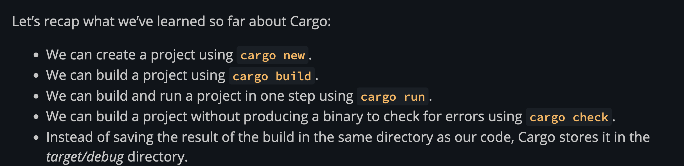
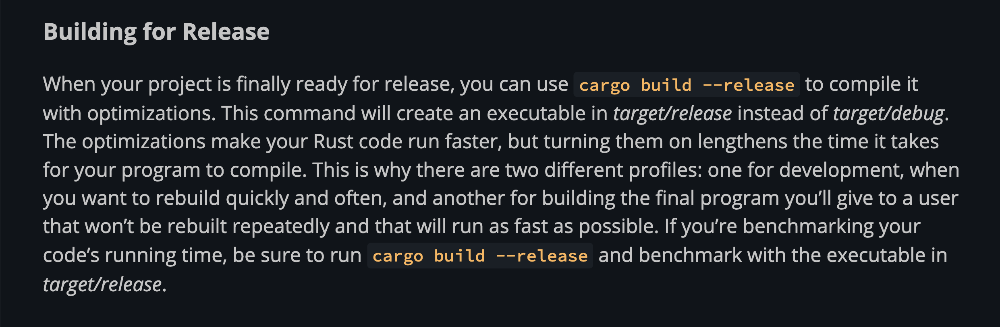

1. build new cargo project `cargo new hello_cargo`
2. run the cargo file `cargo run`
3. This command quickly checks your code to make sure it compiles but doesn’t produce an executable. `cargo check`
4. test compilation is dev mode (for quick testing & development). Product release compilation is different mode, this will enable optimization, longer compilation time but shorter execution time. 

| Run type | cago check | cargo build --release |    
|---|---|---|
|compilation speed| fast | slow |
|compilation speed| slow | fast | 
|Purpose| for quick development & testing | for actual productionr release|

