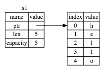
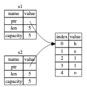
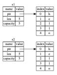
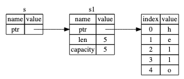

# Understanding ownership 
It enables Rust to make memory safety guarantees without needing a garbage collector, so it’s important to understand how ownership works.

Ownership is a set of rules that govern how a Rust program manages memory. 

General memory management of programming language: 
-garbage collector 
-explicitly allocate and free the memory.
-Rust uses a third approach: memory is managed through a system of ownership with a set of rules that the compiler checks.


## Understand heap vs stack [important concept]
```
let x = 5;
let y = x;
```
Code section A. 

Code sec A is x=y=5, and basically this will be pushed onto the stack. 

```
let s1 = String::from("hello");
let s2 = s1;
```
Code section B. 


Take note the string stores its info on the stack (left hand side), and there is a pointer pointing to the memory that holds the content of the string (on the right),  On the right is the memory on the heap that holds the contents.


When we assign s1 to s2, the String data is copied, meaning we copy the pointer, the length, and the capacity that are on the stack. We do not copy the data on the heap that the pointer refers to.


we are not doing this, this is copying down to the heap level, and this is an expensive operation (in terms of runtime performance).

There is a problem here, since they are both pointing to the same meory, when it gets out of scope, they will both drop on the same memory location in heap, and this is an ISSUE! AKA the double free error. 
```
Freeing memory twice can lead to memory corruption, which can potentially lead to security vulnerabilities.
To ensure memory safety, after the line let s2 = s1;, Rust considers s1 as no longer valid.

If you’ve heard the terms shallow copy and deep copy while working with other languages, the concept of copying the pointer, length, and capacity without copying the data probably sounds like making a shallow copy. But because Rust also invalidates the first variable, instead of being called a shallow copy, it’s known as a move.
```
^ shallow and deep copy, exactly! 

TO achieve deep copy, one can use clone! 
```
    let s1 = String::from("hello");
    let s2 = s1.clone();

    println!("s1 = {}, s2 = {}", s1, s2);

```

However, Code Section A is completely valid, why does the above memory handling logic not applicable to Section A??? 
It's because for integers (have known size at compile time), it's stored entirely on the stack and not the heap, so copies of the actual values are quick to make. That means there’s no reason we would want to prevent x from being valid after we create the variable y.


There is also special annotation called `copy` that can place on types stored on stack, allowing copy operation rather than `move` operation. 


## Ownership Rules 
- Each value has its own Owner 
- When the owner gets out of scope, the value dropped. 
- There can only be one owner at a time. 


Important notes regarding memoery allocation 
```
However, the second part is different. In languages with a garbage collector (GC), the GC keeps track of and cleans up memory that isn’t being used anymore, and we don’t need to think about it. In most languages without a GC, it’s our responsibility to identify when memory is no longer being used and to call code to explicitly free it, just as we did to request it. Doing this correctly has historically been a difficult programming problem. If we forget, we’ll waste memory. If we do it too early, we’ll have an invalid variable. If we do it twice, that’s a bug too. We need to pair exactly one allocate with exactly one free.
```

When variable is outside of the scope {}, it will be dropped automatically.
```
Note: In C++, this pattern of deallocating resources at the end of an item’s lifetime is sometimes called Resource Acquisition Is Initialization (RAII). The drop function in Rust will be familiar to you if you’ve used RAII patterns.
```


## Ownership and Functions
when u pass a variable to another function, you are passing its ownership to it as well..
meaning the variable will no longer be valid in the original function scope. 

This is troublesome! Does Rust has `Reference` feature to transfer value without removing ownership! 


## Reference and borrowing 

`&`
 A reference is like a pointer in that it’s an address we can follow to access the data stored at that address; that data is owned by some other variable. 

```
Note: The opposite of referencing by using & is dereferencing, which is accomplished with the dereference operator, *. We’ll see some uses of the dereference operator in Chapter 8 and discuss details of dereferencing in Chapter 15.
```
We call the action of creating a reference borrowing. 

#### Mutable restriction 

Note
```
Mutable references have one big restriction: if you have a mutable reference to a value, you can have no other references to that value. 

The benefit of having this restriction is that Rust can prevent data races at compile time. A data race is similar to a race condition and happens when these three behaviors occur:

- Two or more pointers access the same data at the same time.
- At least one of the pointers is being used to write to the data.
- There’s no mechanism being used to synchronize access to the data.

Data races cause undefined behavior and can be difficult to diagnose and fix when you’re trying to track them down at runtime; Rust prevents this problem by refusing to compile code with data races!

```

## Dangling reference 

Note: 
```
In languages with pointers, it’s easy to erroneously create a dangling pointer—a pointer that references a location in memory that may have been given to someone else—by freeing some memory while preserving a pointer to that memory.

In Rust, by contrast, the compiler guarantees that references will never be dangling references: if you have a reference to some data, the compiler will ensure that the data will not go out of scope before the reference to the data does.
```

# The Rules of References
Notes:
```
Let’s recap what we’ve discussed about references:

At any given time, you can have either one mutable reference or any number of immutable references.
References must always be valid.
```


## The slice type 
`&str` 

# Summary 
Note: 
```
Summary
The concepts of ownership, borrowing, and slices ensure memory safety in Rust programs at compile time. The Rust language gives you control over your memory usage in the same way as other systems programming languages, but having the owner of data automatically clean up that data when the owner goes out of scope means you don’t have to write and debug extra code to get this control.

Ownership affects how lots of other parts of Rust work, so we’ll talk about these concepts further throughout the rest of the book.

```

#### keywords 
mutable reference 
immutable reference 
references and borrowing 
ownership 
heap and stack 
